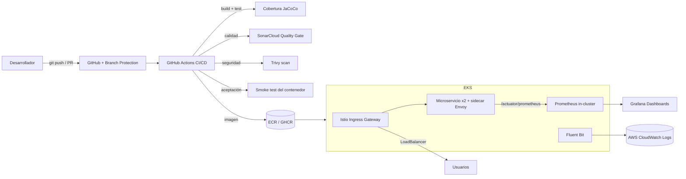

# Observabilidad y entornos reales en DevOps (DOY0101)

Microservicio de inventario con un pipeline DevOps completo que integra **monitoreo, métricas, dashboards, despliegue automático en Kubernetes en la nube, malla de servicios (Istio), logging en CloudWatch y políticas de cumplimiento automatizado**.

> Ingeniería DevOps — Duoc UC. Proyecto del semestre (EP1–EP3) y Evaluación Final Transversal.

## 👥 Integrantes

| Nombre | Rol |
|--------|-----|
| Marco Parra | Desarrollador |
| Luis Inostroza | Desarrollador |

## 🔗 Enlaces del proyecto

- **Repositorio:** https://github.com/Marco-Parra25/ep3-devops-observabilidad
- **Análisis de calidad (SonarCloud):** https://sonarcloud.io/dashboard?id=Marco-Parra25_ep3-devops-observabilidad
- **Imagen de contenedor (ECR):** `081611519281.dkr.ecr.us-east-1.amazonaws.com/ep3-observability:latest`
- **Imagen pública (GHCR):** `ghcr.io/marco-parra25/ep3-devops-observabilidad:latest`

---

## 🏗️ Arquitectura



**Flujo:** cada cambio entra por un Pull Request. El pipeline compila, prueba, mide cobertura, analiza calidad (SonarCloud) y seguridad (Trivy) y ejecuta **pruebas de aceptación** sobre el contenedor. Si algún control crítico falla, **el pipeline se detiene y la fusión queda bloqueada**. Al fusionar a `main`, se publica la imagen (ECR/GHCR) y se **despliega automáticamente** en Kubernetes (AWS EKS). Dentro del cluster, **Istio** gestiona la red y las métricas de tráfico, **Prometheus/Grafana** la observabilidad y **Fluent Bit** envía los logs a **AWS CloudWatch**.

---

## ✅ Indicadores cubiertos

| Indicador | Descripción | Implementación |
|-----------|-------------|----------------|
| **IE1** | Monitoreo: logs, métricas, errores, disponibilidad | Actuator + Micrometer + Prometheus + reglas de alerta + logs en CloudWatch |
| **IE2** | Despliegue en Kubernetes en la nube | AWS EKS (2 nodos), 2 réplicas, LoadBalancer, Prometheus in-cluster |
| **IE3** | Dashboards con métricas clave | Grafana: tiempo de despliegue, cobertura, CPU/memoria, errores |
| **IE4** | Documentar integración en CI/CD | Este README + `docs/INFORME.md` |
| **IE5** | Cumplimiento y auditoría | SonarCloud + branch protection + Trivy + Dependabot |
| **IE6** | El pipeline se detiene ante fallas críticas | Quality gate de cobertura + Sonar + Trivy (exit-code 1) |

### Extensiones (Evaluación Final Transversal)

| Capacidad | Dónde |
|-----------|-------|
| **Malla de servicios Istio** (red, mTLS, circuit breaker, métricas de tráfico) | `k8s/istio/` |
| **Logging/métricas en AWS CloudWatch** (Fluent Bit) | `k8s/cloudwatch/` |
| **Dependabot** (dependencias vulnerables) | `.github/dependabot.yml` |
| **Pruebas de aceptación** antes de producción | job `acceptance-test` en el pipeline |
| **Publicación de imagen** en registro público (GHCR) | job `publish-image` en el pipeline |
| **Modelo de ramas** (main/develop/feature/hotfix) | `docs/BRANCHING.md` |

---

## 🧱 Stack tecnológico

- **Lenguaje/Framework:** Java 21, Spring Boot 3.5
- **Observabilidad:** Spring Boot Actuator, Micrometer, Prometheus, Grafana, Pushgateway, AWS CloudWatch (Fluent Bit)
- **Contenedores:** Docker (multi-stage, usuario no-root)
- **Orquestación / red:** Kubernetes (AWS EKS), eksctl, Istio (service mesh)
- **CI/CD:** GitHub Actions
- **Calidad/Seguridad:** SonarCloud, Trivy, JaCoCo, branch protection, Dependabot
- **Registro de imágenes:** Amazon ECR / GitHub Container Registry (GHCR)

## 📁 Estructura del repositorio

```
├── src/                         # Código del microservicio (Java)
├── k8s/                         # Manifiestos Kubernetes + config del cluster
│   ├── 01-namespace.yaml
│   ├── 02-deployment.yaml
│   ├── 03-service.yaml
│   ├── 04-prometheus.yaml       # Prometheus dentro del cluster
│   ├── eks-cluster.yaml         # Definición del cluster EKS
│   ├── istio/                   # Malla de servicios (Gateway, VirtualService, DR, mTLS)
│   └── cloudwatch/              # Fluent Bit -> CloudWatch Logs
├── monitoring/                  # Stack de monitoreo local (docker-compose)
├── scripts/push-ci-metrics.sh   # Empuja métricas de CI al Pushgateway
├── .github/
│   ├── workflows/ci-cd.yml      # Pipeline CI/CD
│   └── dependabot.yml           # Actualización automática de dependencias
├── Dockerfile                   # Imagen multi-stage
└── docs/
    ├── INFORME.md               # Informe formal
    └── BRANCHING.md             # Modelo de ramificación
```

---

## ▶️ Cómo ejecutar

### 1. Microservicio en local

```bash
export JAVA_HOME="/opt/homebrew/opt/openjdk@21/libexec/openjdk.jdk/Contents/Home"
mvn clean verify          # compila, prueba y valida cobertura (>=70%)
mvn spring-boot:run       # arranca en http://localhost:8080
```

Endpoints principales: `/api/products`, `/actuator/health`, `/actuator/prometheus`.

### 2. Monitoreo local (Prometheus + Grafana)

```bash
cd monitoring && docker compose up -d
# Grafana: http://localhost:3000   ·   Prometheus: http://localhost:9090
```

### 3. Despliegue en AWS EKS

```bash
# Crear el cluster (usa LabRole de AWS Academy)
eksctl create cluster -f k8s/eks-cluster.yaml

# Desplegar microservicio y Prometheus
kubectl apply -f k8s/01-namespace.yaml -f k8s/02-deployment.yaml \
              -f k8s/03-service.yaml -f k8s/04-prometheus.yaml
kubectl get svc -n devops-ep3        # URL pública
```

### 4. Malla de servicios (Istio) y logging (CloudWatch)

```bash
# Istio
istioctl install --set profile=demo -y
kubectl label namespace devops-ep3 istio-injection=enabled --overwrite
kubectl rollout restart deployment/observability-service -n devops-ep3
kubectl apply -f k8s/istio/observability-istio.yaml

# CloudWatch (logs)
kubectl apply -f k8s/cloudwatch/fluent-bit.yaml
```

> ⚠️ **Al terminar, borrar el cluster para evitar costos:**
> `eksctl delete cluster --name <nombre-cluster> --region us-east-1` (borra también los ELB de Istio).

---

## 🔄 El pipeline CI/CD (IE4)

El pipeline (`.github/workflows/ci-cd.yml`) se ejecuta en cada push y Pull Request:

1. **Build, Test y Cobertura** — compila, ejecuta pruebas y valida cobertura con JaCoCo (mínimo 70%). Si baja del umbral, **detiene el pipeline**.
2. **Análisis de seguridad (Trivy)** — escanea dependencias; con `exit-code: 1` en HIGH/CRITICAL, **detiene el pipeline**.
3. **Pruebas de aceptación** — levanta el contenedor real y valida salud y métricas antes de permitir el despliegue.
4. **Publicar imagen (GHCR)** — publica la imagen en el registro público cuando todo lo anterior pasa.
5. **Desplegar en AWS EKS** — solo al fusionar a `main`: construye, publica en ECR y actualiza el despliegue (`kubectl set image` + rollout), sin intervención manual.

En paralelo, **SonarCloud** analiza cada PR (Quality Gate). La **protección de rama** exige que los controles obligatorios pasen antes de fusionar a `main`. Ver el modelo de ramas en [`docs/BRANCHING.md`](docs/BRANCHING.md).

> 💡 **Cómo apoya la toma de decisiones técnicas:** documentar cómo se integran las herramientas en el pipeline permite que cualquier integrante o evaluador entienda de qué manera cada una (pruebas, cobertura, SonarCloud, Trivy, despliegue) aporta al proceso y a la toma de decisiones técnicas. Esta trazabilidad facilita mantener y mejorar el sistema de forma continua.

---

## 🤖 Declaración de uso de Inteligencia Artificial

Durante el desarrollo se utilizó el asistente **Claude Code (Anthropic)** como apoyo para: generación y depuración de código, configuración de herramientas (pipeline, manifiestos, monitoreo), redacción de esta documentación técnica y creación de diagramas.

Todas las **decisiones técnicas, justificaciones, conclusiones y reflexiones individuales** fueron elaboradas por el equipo sin asistencia de IA, según las indicaciones de la evaluación. El contenido generado con apoyo de IA fue revisado y validado por los integrantes.

Referencia de citación de IA: https://bibliotecas.duoc.cl/ia
