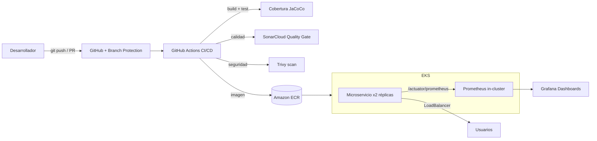

# Observabilidad y entornos reales en DevOps — EP3 (DOY0101)

Microservicio de inventario con un pipeline DevOps completo que integra **monitoreo, métricas, dashboards, despliegue en Kubernetes en la nube y políticas de cumplimiento automatizado**.

> Evaluación Parcial 3 — Ingeniería DevOps, Duoc UC.

## 👥 Integrantes

| Nombre | Rol / aportes |
|--------|---------------|
| _(completar)_ | _(completar)_ |
| _(completar)_ | _(completar)_ |

## 🔗 Enlaces del proyecto

- **Repositorio:** https://github.com/Marco-Parra25/ep3-devops-observabilidad
- **Análisis de calidad (SonarCloud):** https://sonarcloud.io/dashboard?id=Marco-Parra25_ep3-devops-observabilidad
- **Imagen de contenedor (ECR):** `654654493647.dkr.ecr.us-east-1.amazonaws.com/ep3-observability:latest`

---

## 🏗️ Arquitectura



**Flujo:** cada cambio entra por un Pull Request. El pipeline compila, prueba, mide cobertura, analiza calidad (SonarCloud) y seguridad (Trivy). Si algún control crítico falla, **el pipeline se detiene y la fusión queda bloqueada**. Al fusionar a `main`, se publica la imagen y se despliega en Kubernetes (AWS EKS), donde Prometheus recolecta métricas que Grafana visualiza.

---

## ✅ Indicadores de evaluación cubiertos

| Indicador | Descripción | Implementación |
|-----------|-------------|----------------|
| **IE1** | Monitoreo: logs, métricas, errores, disponibilidad | Spring Boot Actuator + Micrometer + Prometheus + reglas de alerta |
| **IE2** | Despliegue en Kubernetes en la nube | AWS EKS (2 nodos), 2 réplicas, LoadBalancer, Prometheus in-cluster |
| **IE3** | Dashboards con métricas clave | Grafana: tiempo de despliegue, cobertura, CPU/memoria, errores |
| **IE4** | Documentar integración en CI/CD | Este README + informe en `docs/` |
| **IE5** | Cumplimiento y auditoría | SonarCloud + branch protection + Trivy |
| **IE6** | El pipeline se detiene ante fallas críticas | Quality gate de cobertura + Quality Gate de Sonar + Trivy (exit-code 1) |

---

## 🧱 Stack tecnológico

- **Lenguaje/Framework:** Java 21, Spring Boot 3.5
- **Observabilidad:** Spring Boot Actuator, Micrometer, Prometheus, Grafana, Pushgateway
- **Contenedores:** Docker (multi-stage, usuario no-root)
- **Orquestación:** Kubernetes (AWS EKS), eksctl
- **CI/CD:** GitHub Actions
- **Calidad/Seguridad:** SonarCloud, Trivy, JaCoCo, branch protection
- **Registro de imágenes:** Amazon ECR / GitHub Container Registry

## 📁 Estructura del repositorio

```
├── src/                         # Código del microservicio (Java)
├── k8s/                         # Manifiestos Kubernetes + config del cluster EKS
│   ├── 01-namespace.yaml
│   ├── 02-deployment.yaml
│   ├── 03-service.yaml
│   ├── 04-prometheus.yaml       # Prometheus dentro del cluster
│   └── eks-cluster.yaml         # Definición del cluster EKS
├── monitoring/                  # Stack de monitoreo local (docker-compose)
│   ├── docker-compose.yml
│   ├── prometheus/
│   └── grafana/
├── scripts/push-ci-metrics.sh   # Empuja métricas de CI al Pushgateway
├── .github/workflows/ci-cd.yml  # Pipeline CI/CD
├── Dockerfile                   # Imagen multi-stage
└── docs/INFORME.md              # Informe formal de la evaluación
```

---

## ▶️ Cómo ejecutar

### 1. Microservicio en local

```bash
export JAVA_HOME="/opt/homebrew/opt/openjdk@21/libexec/openjdk.jdk/Contents/Home"
mvn clean verify          # compila, prueba y valida cobertura (>=70%)
mvn spring-boot:run       # arranca en http://localhost:8080
```

Endpoints principales:
- API: `http://localhost:8080/api/products`
- Salud: `http://localhost:8080/actuator/health`
- Métricas: `http://localhost:8080/actuator/prometheus`

### 2. Monitoreo local (Prometheus + Grafana)

```bash
cd monitoring
docker compose up -d
# Grafana:     http://localhost:3000  (admin / admin)
# Prometheus:  http://localhost:9090
```

El dashboard "Observabilidad - Microservicio EP3" se provisiona automáticamente.

### 3. Despliegue en AWS EKS

```bash
# Crear el cluster (usa LabRole de AWS Academy)
eksctl create cluster -f k8s/eks-cluster.yaml

# Desplegar el microservicio y Prometheus
kubectl apply -f k8s/01-namespace.yaml -f k8s/02-deployment.yaml \
              -f k8s/03-service.yaml -f k8s/04-prometheus.yaml

# Ver la URL pública
kubectl get svc -n devops-ep3

# IMPORTANTE: borrar el cluster al terminar (evita costos)
eksctl delete cluster --name ep3-cluster --region us-east-1
```

---

## 🔄 El pipeline CI/CD (IE4)

El pipeline (`.github/workflows/ci-cd.yml`) se ejecuta en cada push y Pull Request, con tres etapas:

1. **Build, Test y Cobertura** — compila, ejecuta pruebas y valida cobertura con JaCoCo (mínimo 70%). Si baja del umbral, **falla y detiene el pipeline**.
2. **Análisis de seguridad (Trivy)** — escanea dependencias en busca de vulnerabilidades. Con `exit-code: 1` en severidad HIGH/CRITICAL, **detiene el pipeline** ante hallazgos críticos.
3. **Construir y publicar imagen** — solo en `main`; construye la imagen y la publica en el registro.

En paralelo, **SonarCloud** analiza cada PR (Quality Gate) y publica un check. La **protección de rama** exige que los tres controles (Build/Test, Trivy y SonarCloud) pasen antes de permitir la fusión a `main`.

> 💡 **Cómo apoya la toma de decisiones técnicas:** _(sección para completar por el equipo — ver `docs/INFORME.md`)_

---

## 🤖 Declaración de uso de Inteligencia Artificial

Durante el desarrollo se utilizó el asistente **Claude Code (Anthropic)** como apoyo para: generación y depuración de código, configuración de herramientas (pipeline, manifiestos, monitoreo), redacción de esta documentación técnica y creación de diagramas.

Todas las **decisiones técnicas, justificaciones, conclusiones y reflexiones individuales** fueron elaboradas por el equipo sin asistencia de IA, según las indicaciones de la evaluación. El contenido generado con apoyo de IA fue revisado y validado por los integrantes.

Referencia de citación de IA: https://bibliotecas.duoc.cl/ia
